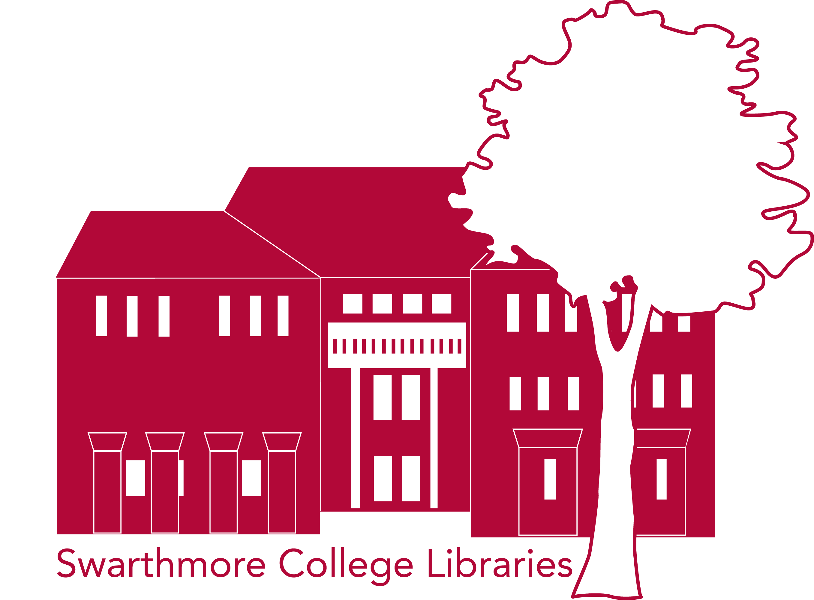

# Coming soon
# About

The Immersive Collections Symposium will bring together library professionals, technologists, and humanities scholars who are using or would like to use immersive technology (XR)  to increase access and interaction with their collections. In the morning session, presenters will describe the application of Virtual Reality (VR), Augmented Reality (AR), and 3D modeling technologies to visualize archival objects, and explain the process as both a technological and scholarly intervention. After lunch, we will hold a demonstration to allow for hands-on experience exploring the XR applications. No experience with XR is required. 

This symposium features a panel of XR practitioners committed to transforming local and global narratives through embodied learning and critical inquiry. The panelists will share how they engage with immersive technologies for access and inclusion, rethinking narrative forms through experiential, multidirectional, multimodal understandings of cultural heritage. Topics range from gamification and literacies, agile and sustainable project development, and global perspectives of virtual cultural heritage. Featured projects include Sacred Geographic Superimpositions, Virtual Blockson, Virtual Angkor, and Immersive Library Services in Vietnam.

# When
**October 13th**
**10am-3pm**

Questions? Email Amanda Licastro at digitalscholarship@swarthmore.edu

## Speakers (coming soon)

<!--div class="contributors-gallery">




<strong>{{ contributor[1].name }}</strong>
{{ contributor[1].bio }}


</div-->

{: .logos}
